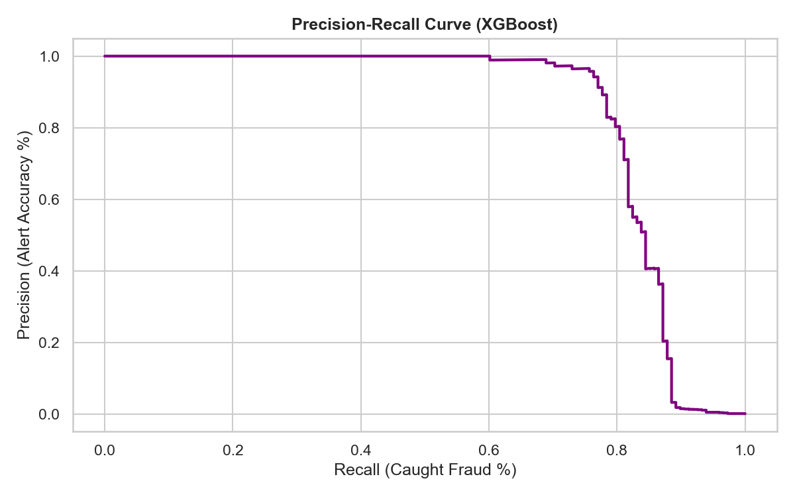
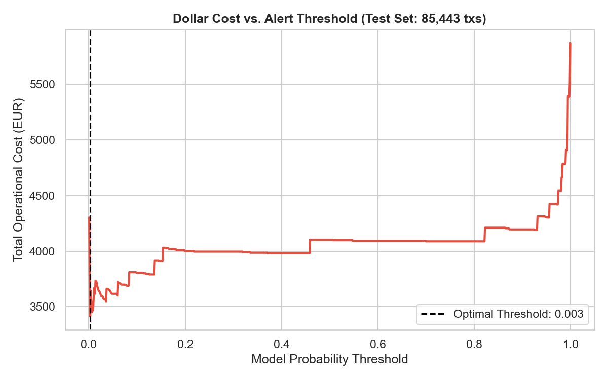
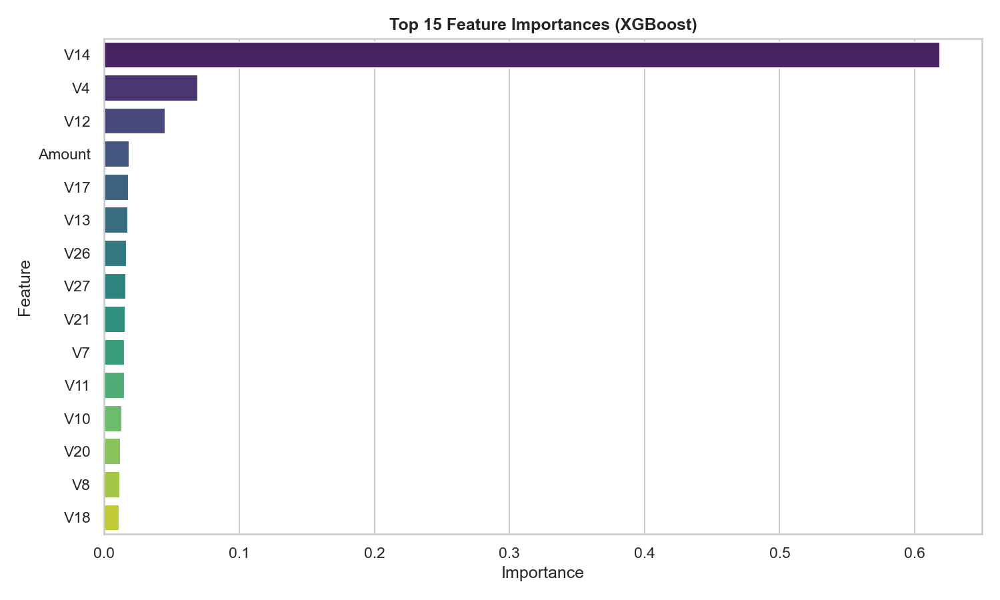

# Detecting Fraudulent Card Transactions (0.17% Positive Rate) — Dollar Cost Optimization

> **Can we flag fraudulent card transactions in real time — and what's the dollar cost of each false positive vs each missed fraud?**

This project analyzes 284,807 European credit card transactions to build a fraud detection model. Because the dataset is extremely imbalanced (only 0.17% of transactions are fraud), accuracy is a meaningless metric. Instead, this project benchmarks ensemble models on PR-AUC (Average Precision) and optimizes the final decision threshold to **minimize the operational dollar cost** of false positives (manual review cost) and false negatives (missed fraud loss).

---

## Key Results

| Metric | Value |
|---|---|
| Champion Model | **XGBoost** |
| PR-AUC (Average Precision) | **0.8346** |
| Recall @ 100 (catching fraud in top 100 alerts) | **66.89%** |
| Dollar-Optimal Threshold | **0.003** |
| Estimated Savings per 100k Transactions | **€17,172.91** |

---

## Visual Insights

### 1. Precision-Recall Curve


### 2. Dollar Cost Optimization


### 3. Feature Importance


*(Note: V1–V28 are PCA-anonymized features. While we cannot translate them back to specific merchant or user data, they provide strong predictive signal for the model.)*

---

## Project Structure

```
Fraud-Detection/
├── README.md                       # ← you are here
├── requirements.txt                # dependencies
├── .gitignore
├── data/
│   ├── creditcard.csv              # dataset (gitignored, downloaded via kagglehub)
│   └── README.md                   # column dictionary & leakage discussion
├── Fraud_Detection_Analysis.ipynb  # core analysis and business memo
└── screenshots/                    # generated charts
```

---

## How to Run

1. Clone the repository and install dependencies:
```bash
git clone https://github.com/Luthiax/fraud-detection.git
cd fraud-detection
pip install -r requirements.txt
```

2. Download the dataset via `kagglehub` (or place `creditcard.csv` in `data/`):
```bash
python -c "import kagglehub; kagglehub.dataset_download('mlg-ulb/creditcardfraud')"
```

3. Run the notebook:
```bash
jupyter notebook Fraud_Detection_Analysis.ipynb
```

---

## Tech Stack


---

## Dataset & Limitations

**Dataset:** ULB MLG / Worldline, 284,807 transactions from European cardholders over 2 days in Sept 2013, only 492 frauds (0.17%), V1–V28 PCA-anonymized, Time in seconds, Amount in EUR. License: Open for research.

**Limitations:**
- PCA-anonymity fundamentally blocks operational root-cause analysis and demographic bias audits.
- The 48-hour window is too short to capture weekly or monthly fraud seasonality.
- The €5 manual review cost is an assumed sensitivity anchor (to be validated with actual ops teams).

---

## About Me

I'm **Leonardo Flores**, a bilingual (English/Spanish) business analytics professional based in Lima, Peru, with a specialization in Business Analytics and AI. 

🔗 [LinkedIn](https://www.linkedin.com/in/leonardo-floresg/) · 🐙 [GitHub](https://github.com/Luthiax)
